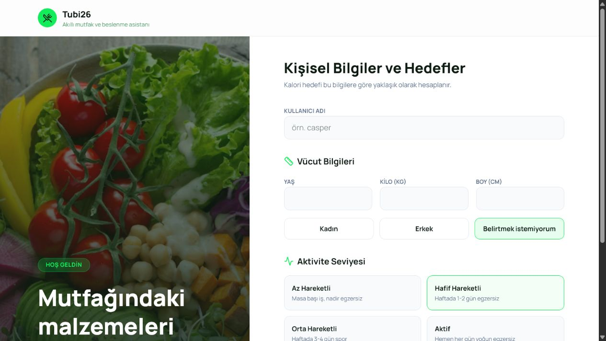
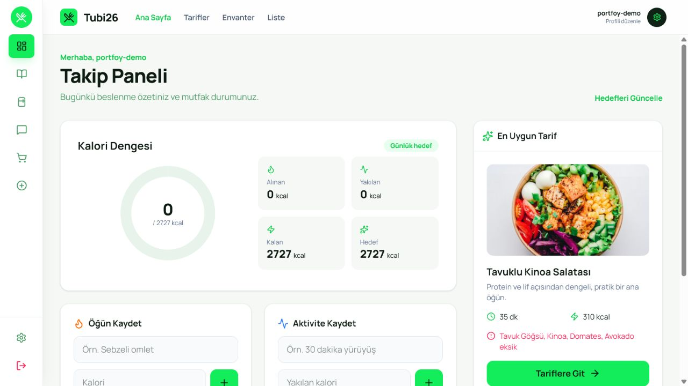

# Tubi26 — Akıllı Mutfak ve Beslenme Asistanı

[](https://github.com/hemdanyusuf/Tubi26/actions/workflows/ci.yml)

Tubi26, evdeki gıdaları takip eden, mevcut malzemelere göre tarifleri sıralayan ve eksikleri otomatik alışveriş listesine dönüştüren full-stack bir uygulamadır. React arayüzü ile Flask API aynı repository içinde çalışır; uygulama verilerini SQLAlchemy ve SQLite saklar.

## Ekran görüntüleri

| Profil ve hedefler | Takip paneli |
| --- | --- |
|  |  |

## Çalışan özellikler

- Kişisel profil ve günlük kalori hedefi hesaplama
- Gıda kataloğundan envantere ürün ekleme, arama ve silme
- Envanter miktarına göre yapılabilir tarif ve eksik malzeme hesabı
- Tarif eksiklerinden otomatik, ayrıca manuel alışveriş listesi oluşturma
- Alışveriş maddelerini tamamlama ve silme
- Günlük kalori, envanter ve yaklaşan son kullanma tarihi özeti
- Envanter bağlamını kullanan sohbet asistanı
- Gemini anahtarı yoksa çalışan yerel ve deterministik sohbet yanıtları

## Teknolojiler

- Frontend: React 19, TypeScript, Vite, Tailwind CSS, Recharts
- Backend: Python, Flask, Flask-SQLAlchemy
- Veritabanı: SQLite (SQLAlchemy üzerinden değiştirilebilir)
- İsteğe bağlı yapay zekâ: Google Gemini, yalnızca sunucu tarafında

## Yerel kurulum

Gereksinimler: Node.js 20+, Python 3.10+.

```bash
npm run setup
```

İsteğe bağlı olarak `.env.example` dosyasını `.env` adıyla kopyalayın. Gemini kullanılacaksa `GOOGLE_API_KEY` değerini yalnızca bu dosyada tutun. Anahtar olmadan da uygulama çalışır.

## Geliştirme

Tek komut iki katmanı birlikte başlatır:

```bash
npm run dev
```

- Arayüz: http://localhost:3000
- API sağlık kontrolü: http://localhost:5000/api/health

İlk başlangıçta SQLite tabloları ve örnek gıda/tarif verileri otomatik oluşturulur.

## Production benzeri çalışma

```bash
npm run build
npm start
```

Flask, oluşan `dist/` klasöründeki React uygulamasını ve `/api/*` uçlarını http://localhost:5000 üzerinden birlikte sunar.

## Yapı

```text
backend/
├── app.py         Flask uygulama fabrikası ve başlangıç noktası
├── models.py      SQLAlchemy veri modelleri
├── routes.py      API ve SPA route'ları
├── services.py    Doğrulama, serileştirme ve iş kuralları
└── extensions.py  Paylaşılan Flask uzantıları
tests/             Pytest API entegrasyon testleri
src/               React + TypeScript arayüzü
.github/workflows/ CI test, type-check ve build akışı
```

## Testler

Backend testleri sağlık kontrolünü, kullanıcı doğrulamasını, envanter akışını, tarif/alışveriş önerilerini ve yerel sohbet fallback'ini kapsar.

```bash
python -m pytest -q
npm run lint
npm run build
```

`.env`, yerel SQLite veritabanı ve build çıktıları Git'e eklenmez. Bu uygulama tıbbi tavsiye vermez; kalori değerleri yaklaşık değerlerdir.
